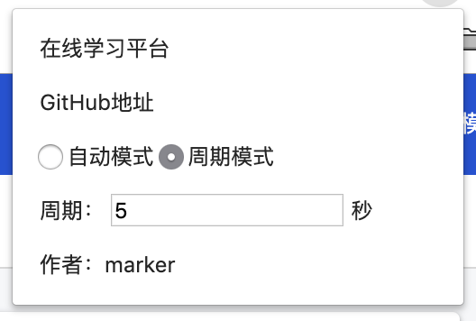

# openLearningStudy
电子科大网络学习平台自动学习脚本

# 使用方法
使用Chrome浏览器 登录网络学习平台选择其中一个课程，然后进入第一章节视屏，【下一个】按钮审查（检查），在进入Console里，将代码粘贴到里面回车即可自动间隔制定时间跳转下一个课程。

# 视频教程地址
http://www.56.com/u16/v_MTQ0Mjg2MjEz.html

- 自动作业：
http://www.yl-blog.com/article/523.html

- 自动学习：
http://www.yl-blog.com/article/534.html

# 时间配置建议

一般学习要求：最少要求学习60秒。配置为60并不一定能学完，因为有网页资源加载的时间或者电脑卡顿造成的。因此时间周期配置尽量多点。
学习1分钟的就配置为2分钟的。

Chrome插件配置的视频学习时间延时为30秒，请保证网速的情况下使用改插件。

# 作业自动化

1、先调整到答案界面，控制台执行homework.js代码，打印出答案。

2、到题目相同的答题界面粘贴dohomework.js 将答案拷贝到参数里，执行。

3、支持单选、多选、判断。

# 关于Chrome插件的使用

[360极速浏览器使用说明](https://github.com/wuweiit/openLearningStudy/tree/master/doc)

# 更新记录

2019-04-17 新增插件支持周期模式和自动模式，可根据课程执行反馈调整合适的模式；
           感谢izee提交的断点续学判断代码
           
2018-05-21 新增Chrome插件支持，打开视频界面可自动读取学习时间，自动定时学习。

2017-12-28 优化了更多题目结构支持。
