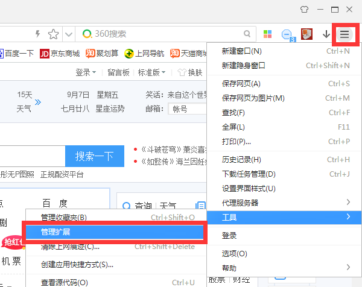
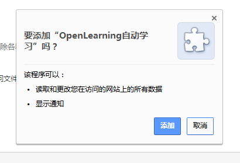
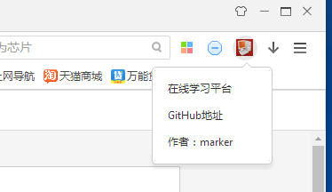
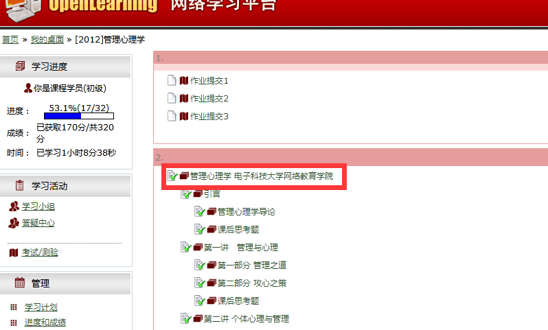
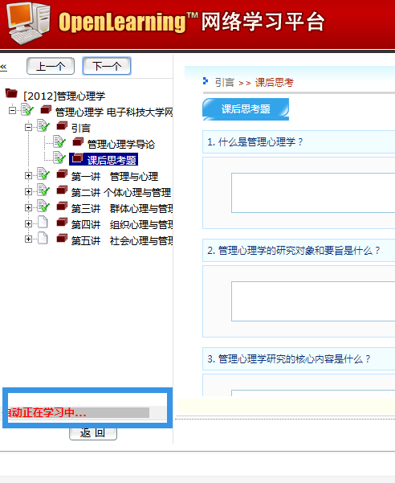

# 360极速浏览器安装说明

 先下载好打包好的crx安装文件，这个文件就是浏览器插件。

crx插件支持所有Chrome内核的浏览器。如果您的浏览器版本不支持请提交Issue。

1、下载安装好360极速浏览器，进入到【扩展管理】功能

2、将crx文件拖拽到扩展管理界面，弹出安装提示，点击【添加】按钮

注意：安装后需要启用插件，才能在网站是使用。

3、安装后右上角出现一台小电脑图标

4、进入到网络学习平台点击一门课程，进入到其中一个视频。

插件会根据当前学习的完成状态判断是否跳转到下一个视频。

注意：进入自动学习模式后就不要到处点击了，会导致插件不能正常运行！

5、左下角会显示自动学习状态。

